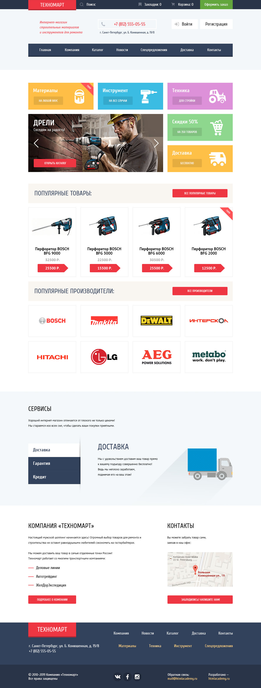
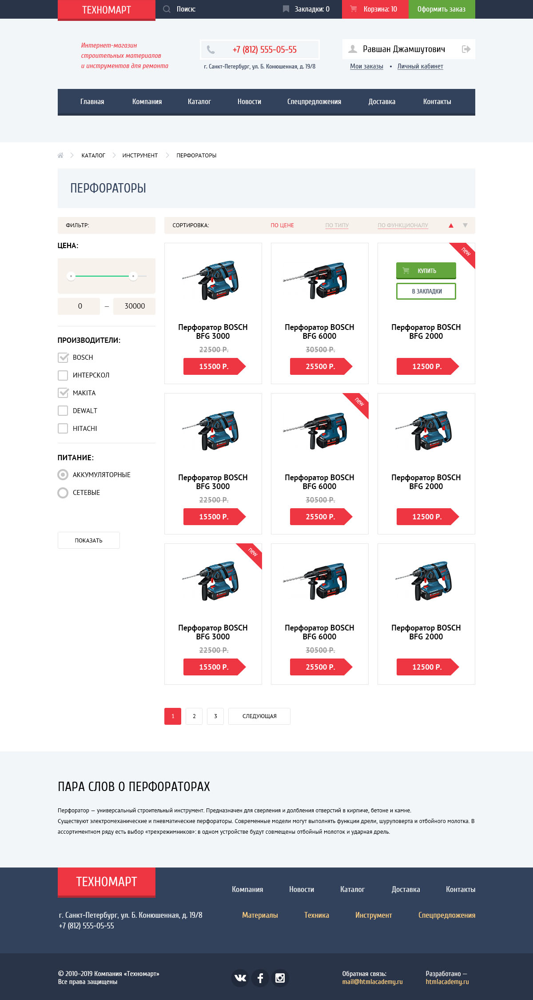

# Проект: Интернет - магазина «Техномарт»

## 📓 Описание проекта:

Техномарт - мой самый первый опыт работы с веб-технологиями. Проект состоит из 2-х страниц фиксированной ширины.

- **Стандарты верстки:** HTML5, CSS3, прогрессивное улучшение.
- **Сетка:** определена в макете.
- **Адаптивность вёрстки:** нет.
- **Используемые фреймворки:** нет.
- **Кроссбраузерность:** Chrome, Firefox, Safari, Edge, Internet Explorer 11.
- **Типографика:** частично определена в макете (прочее — на усмотрение разработчика).
- **Используемые шрифты:** Cuprum, PT Sans (есть в папке с макетом и на Google Fonts).
- **Прочее:** С макетом предоставлен styleguide.psd, содержащий прорисовку состояний элементов интерфейса. При любых расхождениях с макетами он должен иметь наивысший приоритет.
---

## 🔖 Обязательные требования:

1. Контентная область центрируется и не может быть уже макетной ширины. Фоны, которые упираются в края макета должны тянуться на всю страницу.
2. Если пользователь сделал закладку или добавил что-то в корзину, соответствующий пункт в шапке сайта меняет цвет фона на красный (смотрите technomart-catalog.psd).
3. Авторизованному и неавторизованному посетителю показывается разный вид блока авторизации (смотрите technomart-catalog.psd и technomart-index.psd).
4. В блоке авторизованного посетителя имя и иконка пользователя являются ссылкой на профайл, а иконка выхода — на страницу деавторизации.
5. Ссылка в подвале htmlacademy.ru ведёт на лендинг курса «Профессиональный HTML и CSS, уровень 1»

### technomart-index.psd:

6. Промо-блок («материалы», «инструмент», ...): ссылками являются только кнопки.
7. Промо-блок («материалы», «инструмент», ...): слайдер. Вёрстка всех слайдов обязательна. Оживление слайдера необязательно, принцип оживления описан в 7 разделе.
8. Кнопка: «Открыть каталог» в слайдере — это ссылка, которая ведет на внутреннюю страницу (technomart-catalog.psd).
9. Блок «Популярные производители»: карточка производителя является ссылкой.
10. Блок «Сервисы»: слайдер. Вёрстка всех слайдов обязательна. Оживление слайдера необязательно, принцип оживления описан в 7 разделе.
11. Блок карты: достаточная реализация — обычное изображение, клик по ней приводит к переходу на сервис карт.
12. Вёрстка модального окна обязательна (смотрите папку слоёв «write us»).

### technomart-catalog.psd:

13. Логотип — это ссылка на главную страницу.
14. Фильтр: верстать с помощью формы, кнопка «Показать» отвечает за отправку формы.
15. Блок «Цена»: при взаимодействии с любым из маркеров в качестве указателя допускается использовать любой подходящий тип курсора. Делать маркеры интерактивными не обязательно, цена меняться не должна.
16. Количество товаров в правом блоке может быть любым, добавление товаров не должно ломать страницу.
17. У любого товара может быть метка «new».
18. Вёрстка модального окна обязательна (смотрите папку слоёв «cart»).

---

## 🔋 Дополнительные требования

### technomart-index.psd:

1. Промо-блок («материалы», «инструмент», ...): оживление слайдера. Смена слайдов в слайдере должна происходить мгновенно, без промежуточных состояний и анимации.
2. Блок «Сервисы»: оживление слайдера. Слайдер с табами работает аналогично слайдеру промо-блока: по клику на таб меняется слайд мгновенно.
3. Блок карты: обычное изображение. Клик по ней приводит к появлению полного размера интерактивной карты (смотрите папку слоёв «map hover»). Окно позиционируется относительно вьюпорта, а не страницы. Реализация по желанию.
4. При клике по кнопке «Заблудились?..» появляется модальное окно (смотрите папку слоёв «write us»), окно позиционируется относительно вьюпорта, а не страницы.

### technomart-catalog.psd:

5. При клике на кнопку «Купить» появляется модальное окно с сообщением о добавлении в корзину (смотрите папку слоёв «cart» в technomart-catalog.psd). Окно позиционируется относительно вьюпорта, а не страницы.
6. Фильтр: по нажатию кнопки «Показать» осуществляется отправка формы.

---

## 🗺️ Макет:
### Главная страница:

      

### Страница каталога:

      

---

## 🧪 Опыт и сложности:

Сам проект не показался сложным, скорее интересным. Смог разобраться с HTML5 / CSS3. Попробовал CSS анимации, подключил JavaScript. В принципе, после выполнения проекта я понял, что хочу этим заниматься.
